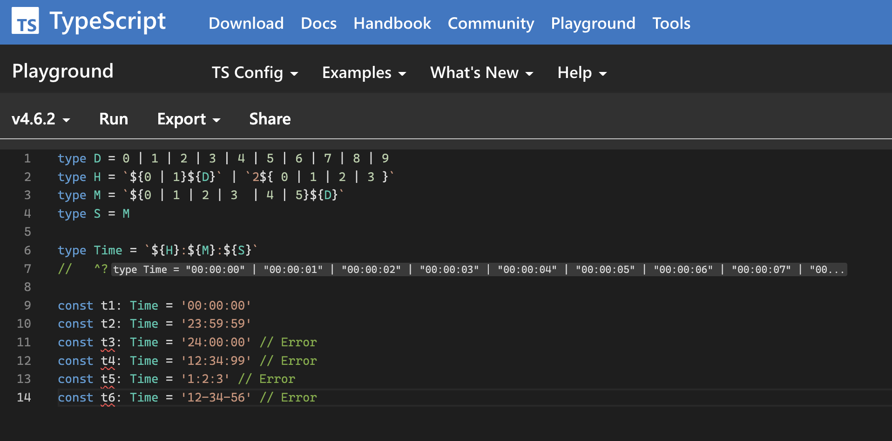

import Header from '../../../components/Header.astro'
import Baseline from '../../../components/Baseline.astro'

<Header {...frontmatter} />

[TypeScript Playground](https://www.typescriptlang.org/play)でコードを書く際、インライン表示したい形の下に`^?`をコメントすることで、マウスオーバーしなくても型情報が表示される。スクショを撮るときに便利！


```ts
type MyType = ...
//   ^?


const xxx = getMyType();
//   ^?
```


