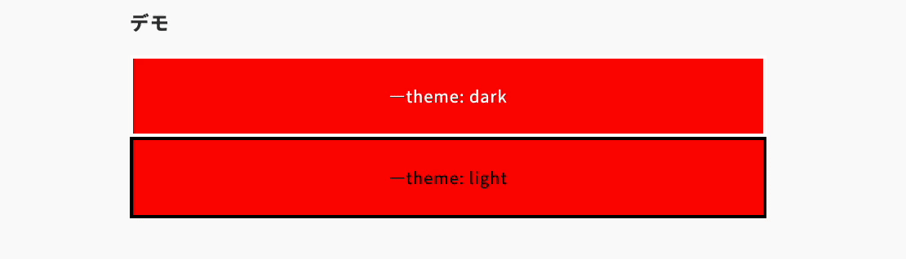

import Header from '../../../components/Header.astro'

<Header {...frontmatter} />

[Inline conditionals（if()）](https://github.com/w3c/csswg-drafts/issues/10064)が CSS Values Module Level 5 の仕様に追加される。

`@supports`や`style(--variable, val)`のような分岐をブロックにわけず書けるようになるので、スコープが狭くなり可読性が向上する。

## Before

```css
.class {
  prop: xxx;
}
@supports (...) {
  .class {
    prop: yyy;
  }
}
```

## After

```css
.class {
  prop: if(supports(...), xxx, yyy);
}
```

## 追記: 2025-05-14

[Chrome 137 Beta](https://developer.chrome.com/blog/chrome-137-beta)で`if()`が実装された。

また、[CSS Values and Units Module Level 5](https://www.w3.org/TR/css-values-5/#if-notation)の仕様も少し変わった。

```
<if()> = if( [ <if-condition> : <declaration-value>? ; ]*
             <if-condition> : <declaration-value>? ;? )
<if-condition> = <boolean-expr[ <if-test> ]> | else
<if-test> =
  supports( [ <supports-condition> | <ident> : <declaration-value> ] ) |
  media( <media-query> ) |
  style( <style-query> )
```

つまり`if(condition: value1; else: value2);`という書き方になった。

```css
.container {
  color: if(style(--theme: dark): white; else: black);
}

.container {
  display: if(supports(display: grid): grid; else: block);
}

.container {
  background-color: if(
    media(min-width: 1024px): red;
    media(min-width: 768px): blue;
    else: green;
  );
}
```

### デモ

<section id="demo">
  <div class="container" style="--theme: dark">
    <p>--theme: dark</p>
  </div>
  <div class="container" style="--theme: light">
    <p>--theme: light</p>
  </div>
</section>

<style>{`
#demo {
  .container {
    display: grid;
    height: 100px;
    border: 4px solid;
    margin-bottom: 1rem;

    color: if(style(--theme: dark): white; else: black);
    background-color: if(
      media(min-width: 1024px): red;
      media(min-width: 768px): blue;
      else: green;
    );

    p {
      text-align: center;
      align-self: center;
    }
  }
}
`}</style>



