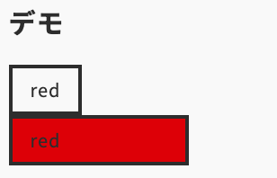

import Header from '../../../components/Header.astro'
import Baseline from '../../../components/Baseline.astro'

<Header {...frontmatter} />


[attr()](https://developer.mozilla.org/ja/docs/Web/CSS/attr)という要素の属性の値を受け取ってCSS内で使用できる機能が進化して、`<color>`や`<length>`などを受け取れるようになった。

この仕様は、[CSS Values and Units Module Level 5](https://drafts.csswg.org/css-values-5/#attr-notation)のWOrking Draftで策定されている。

<Baseline featureId={"attr"} />

## 新しい`attr()`の使い方

```html
<div class="legacy" data-color="red" data-size="200"></div>

<div class="new" data-color="red" data-size="200"></div>
```

```css
.legacy::after {
  content: attr(data-color);
  /* not working */
  background-color: attr(data-color);
  /* not working */
  width: attr(data-size);
}

.new::after {
  content: attr(data-color);
  background-color: attr(data-color type(<color>), inherit);
  width: attr(data-size px, fit-content);
}
```

## デモ

<section id="demo">
  <div class="legacy" data-color="red" data-size="200"></div>

  <div class="new" data-color="red" data-size="200"></div>
</section>


<style>{`
  #demo {
    ::after {
      border: 4px solid;
      padding: .2em 1em;
      display: inline-block;
    }

    .legacy::after {
      content: attr(data-color);
      background-color: attr(data-color);
      width: attr(data-size);
    }

    .new::after {
      content: attr(data-color);
      background-color: attr(data-color type(<color>), inherit);
      width: attr(data-size px, fit-content);
    }
  }
`}</style>


