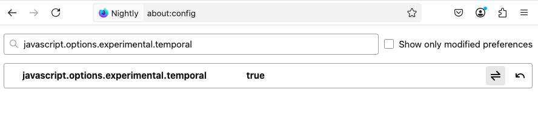

import Header from '../../../components/Header.astro'
import Baseline from '../../../components/Baseline.astro'

<Header {...frontmatter} />

Firefoxが[Temporalオブジェクト](https://developer.mozilla.org/en-US/docs/Web/JavaScript/Reference/Global_Objects/Temporal)をExperimentalとしてリリースした。

JavaScriptで日付・時刻を操作するには、[Dateオブジェクト](https://developer.mozilla.org/ja/docs/Web/JavaScript/Reference/Global_Objects/Date)を使う。ここでは割愛するが、いろいろな問題・課題があり、Web開発の現場では日付操作ライブラリを使うことが多い。

Temporalオブジェクトを使うことで、JavaScriptによる日付・時刻操作が大幅に簡素化され、dayjs、date-fns（やmoment.js）などのライブラリを使わなくても、同様な機能をネイティブがサポートしてくれるようになる。

<Baseline featureId={"temporal"} />

2025-02-06時点では、Firefox Nightlyで `javascript.options.experimental.temporal` フラグを有効にすることで利用可能になる。




## Temporalオブジェクトの基本

- `Temporal.Duration`: 時間の長さ（2つの時差）を表す
- `Temporal.Instant`: タイムスタンプ（≒ Dateオブジェクト）
- `Temporal.ZonedDateTime`: タイムゾーン付きの日時
- `Temporal.PlainDateTime`: ≒ ZonedDateTime
   - `Temporal.PlainDate`: 日付（年月日）
   - `Temporal.PlaynYearMonth`: 年月
   - `Temporal.PlainMonthDay`: 月日
- `Temporal.PlainTime`: 時刻（時分秒ミニマイクロナノ…）

## 日時を取得する

```js
const now = Temporal.Now.instant()

// RFC9557形式を返す
now.toJSON() // 2025-02-06T00:34:42.328Z

// instantの言語に依存した文字列を返す
now.toLocaleString() // 2/6/2025, 9:34:42 AM

// 指定されたタイムゾーンを使ってRFC9557形式で返す
now.toString() // 2025-02-06T00:34:42.328Z

// タイムゾーンを指定し、その地域の形式の文字列を返す
const timezone = Temporal.Now.timeZoneID() // Asia/Tokyo
now
  .toZonedDateTimeISO(timezone) // = ZonedDateTime
  .toLocaleString() // 2/5/2025, 7:34:42 PM EST
```

## 日付の加減算

`add`や`subtract`メソッドを使うことで、加減算ができる。

`add({ days: 10 })`や`add({ days: -10 })`のように負の数を渡すことも可能。

```js
// const today = Temporal.Now.instant()
const today = Temporal.PlainDate.from('2024-01-01')
const added = today.add({ days: 32 })
const subtracted = today.subtract({ days: 32})

console.log(today.toString()) // 2024-01-01
console.log(added.toString()) // 2024-02-02
console.log(subtracted.toString()) // 2023-11-30
```

また、`add()`や`subtract()`の引数に、以下のようなオブジェクトを渡すことで日付以外の操作もできる。

```ts
{
  years?: number
  months?: number
  days?: number
  hours?: number
  minutes?: number
  seconds?: number
  // ...
}
```

## 月初・月末の取得

`with()`メソッドを使うことで、月初・月末の日付が取得できる。

また、`daysInMonth`プロパティを参照することで、その月の日数を取得できる。

```js
const today = Temporal.PlainDate.from('2024-02-10')

const startOfMonth = today.with({ day: 1 }) // 2024-02-01

const day = today.daysInMonth // 29
const endOfMonth = today.with({ day }) // 2024-02-29
// or today.with({ day: 31 }) // 2024-02-29
```
