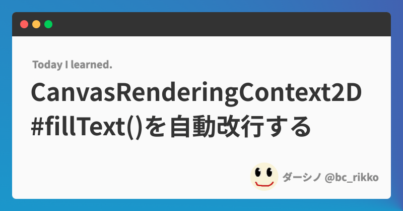

import Header from '../../../components/Header.astro'
import Baseline from '../../../components/Baseline.astro'

<Header {...frontmatter} />

[Canvas API](https://developer.mozilla.org/en-US/docs/Web/API/Canvas_API)は、ブラウザでゲーム開発や画像生成をするためには必要不可欠なAPIだ。

しかし、テキストを描画する[CanvasRenderingContext2D#fillText()](https://developer.mozilla.org/en-US/docs/Web/API/CanvasRenderingContext2D/fillText)には、自動改行できないという弱点がある。第3引数で`maxWidth`を指定できるのではみ出すことはないが、改行ではなく文字列が圧縮されてしまう。

そこで[CanvasRenderingContext2D.measureText()](https://developer.mozilla.org/en-US/docs/Web/API/CanvasRenderingContext2D/measureText)を使って、文字列の幅を計測し、`maxWidth`に到達しそうになったら改行するという処理が必要になる。

```ts
const text = 'maxWidthを超えてしまうため改行処理が必要なほど長い文章'

const canvas = document.createElement('canvas')
const ctx = canvas.getContext('2d')

// Canvasのサイズ
const Size = { w: 640, h: 480 } as const
canvas.width = Size.w
canvas.height = Size.h

// font-size
const FontSize = 48 as const
ctx.font = `${FontSize}px`

// 文字列を描画しはじめる座標
// 文字列の描画開始位置を変えたい場合は、ここを変更する
let x = 0
let y = 0
const Gap = 20 as const

// 1行に書く文字を格納するテンポラリ変数
let line = ''

for (const word of text.split('')) {
  // 1文字加えてから文字列のwidthを計測する
  const testLine = line + word
  const testWidth = ctx.measureText(testLine).width

  if (textWidth > maxWidth) {
    // 文字列がmaxWidthを超えたので描画してから改行する
    ctx.fillText(line, x, y)
    line = word
    y += FontSize + Gap
  } else {
    // maxWidthに納まっているのでlineに格納、次の文字を結合して再度widthのチェックをする
    line = testLine
  }
}

// 最終行を描画する
ctx.fillText(line, x, y)
```

## デモ


