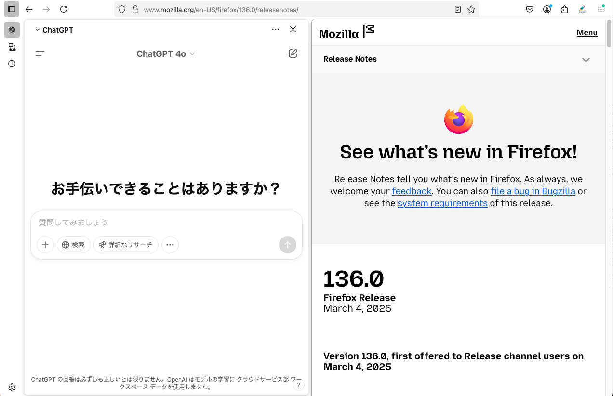

import Header from '../../../components/Header.astro'

<Header {...frontmatter} />

[Firefox 136](https://www.mozilla.org/en-US/firefox/136.0/releasenotes/)がリリースされた。

今回のリリースの目玉機能は「Sidebar tooles include an AI chatbot」だ。FirefoxのサイドバーにChatGPTやGeminiなどを表示し、ブラウザで表示している内容を渡して処理できるという機能である。この機能を使うことで、ページに表示されている文章をそのままAIに渡して、要約や説明、クイズ作成などができる。


## 設定方法

Settings > General > Browser Layout から「Show sidebar」にチェックを入れる。


するとサイドバーにChatGPTやGeminiなどが表示されるので、自分のアカウントでログインすると利用できるようになる。




## 使い方

ページ内で右クリックをすると、コンテキストメニューに「Ask ChatGPT」のような項目が追加されているだろう。

そこから、「Summarize」や「Explain this」、「Quiz me」などを選択することで、ページの内容をAIに渡して処理ができる。

ページ内容を渡すには`<tabTitle>タブのタイトル（ページのタイトル）</tabTitle>`という記号が、ページを参照するという意味なので、Format Linkなどの拡張機能を使って以下のようなプロンプトを生成できるようにしておくと便利だろう。

```md
<tabTitle>{text}</tabTitle>を以下の条件をもとに要約して出力してください。

# 条件
- 見出しや小見出しごとに要約する
- 要約文は200〜300文字程度
- 重要なキーワードを取り残さない
- 文章の意味を変更しない
- 文章を簡潔に
```
