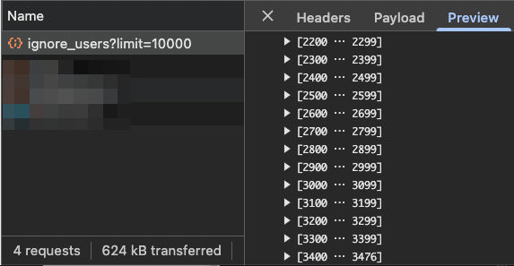

import Header from '../../../components/Header.astro'

<Header {...frontmatter} />

ありがたいことに定期的にツイートや記事を拡散していただいて、賛否はあれど私の主張が多くの人に届くことは素直に嬉しい。ただ、**拡散度合いが一定ラインを超えると急激に怖い人が増えてくる。**

- 書いてないことについて非難してくる
- 書いてあることを読まないで非難してくる
- 背景や前提条件を変えて非難してくる
- 曲解して非難してくる
- 強い言葉（罵倒含む）を使って非難してくる

豆腐メンタルなので、こういった嫌な投稿を見てしまうと夜眠れなくなったり、数日引きずったりする。（※納得感がある批判は別）

そんなときは、**脳が反応する前にブロック（ミュート）して自衛している。**

1. 文章を読む
2. ちょっとでも嫌だと思う表現があったら物理的に目をそらす
3. **「何が書かれていたか」と脳が理解する前にブロック（ミュート）する**
4. リロードする
5. 深呼吸する
6. そんな投稿は最初からなかった
7. 平和なインターネット

この方法が、私にとってもっとも簡単でもっとも効果があるインターネットサバイバル術だ。

---

## おまけ: 音速ブロックの貴公子

はてブの政治カテゴリで鍛えられたブロックスピードは音速をも超える！

