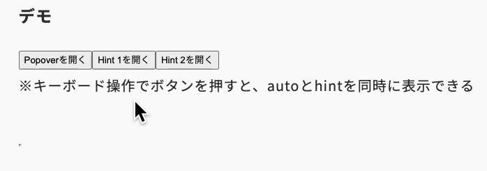

import Header from '../../../components/Header.astro'
import Baseline from '../../../components/Baseline.astro'

<Header {...frontmatter} />

Popover APIの新しいモードとして`hint`が導入されようとしている。

デフォルトの`popover="auto"`の場合、が排他的に制御されるため、一度に複数のポップオーバーを表示することができない。`popover="hint"`を使うことで、popoverメニューを表示しながらツールチップを表示するという処理が実現できる。

<Baseline featureId={"popover-hint"} />

## popover="auto"

以下のようにポップオーバーが複数ある場合は排他的に処理され、Popover2を開くと、すでに開いていたPopover1が閉じられるような挙動になる。
```html
<div id="popover1" popover>Popover 1</div>
<button popovertarget="popover1">Popover 1を開く</button>

<div id="popover2" popover>Popover 2</div>
<button popovertarget="popover2">Popover 2を開く</button>
```

### デモ

<seciton id="demo1">
  <div class="popover" id="popover1" popover="auto" style="position-anchor: --popover1;">Popover 1</div>
  <button popovertarget="popover1" style="anchor-name: --popover1;">Popover 1を開く</button>

  <div class="popover" id="popover2" popover="auto" style="position-anchor: --popover2;">Popover 2</div>
  <button popovertarget="popover2" style="anchor-name: --popover2;">Popover 2を開く</button>
</seciton>

## popover="hint"

`popover="auto"`では、先述のとおり排他的に制御されてしまうため、「メニューを開きながらツールチップを表示する」という処理ができなかった。

`poover="hint"`を使うことで、`popover="auto"`と`popover="hint"`の要素を同時に表示することができる。ただし、`popover="hint"`の要素が複数ある場合は、その中で排他的に制御される。

```html
<div id="popover" popover>Popover</div>
<button popovertarget="popover">Popoverを開く</button>

<div id="hint1" popover>Hint 1</div>
<button popovertarget="hint1">Hint 1を開く</button>

<div id="hint2" popover>Hint 2</div>
<button popovertarget="hint2">Hint 2を開く</button>
```

### デモ

<seciton id="demo2">
  <div class="popover" id="popoverinhint" popover="auto" style="position-anchor: --popover3;">Popover</div>
  <button popovertarget="popoverinhint" style="anchor-name: --popover3;">Popoverを開く</button>

  <div class="popover" id="hint1" popover="hint" style="position-anchor: --hint1;">Hint 1</div>
  <button popovertarget="hint1" style="anchor-name: --hint1;">Hint 1を開く</button>

  <div class="popover" id="hint2" popover="hint" style="position-anchor: --hint2;">Hint 2</div>
  <button popovertarget="hint2" style="anchor-name: --hint2;">Hint 2を開く</button>
</seciton>


<style>{`
.popover {
  position: absolute;
  top: anchor(bottom);
  left: anchor(left);
}

[popover] {
  margin: 0;
  margin-top: .5rem;
}
`}</style>

※キーボード操作でボタンを押すと、autoとhintを同時に表示できる



