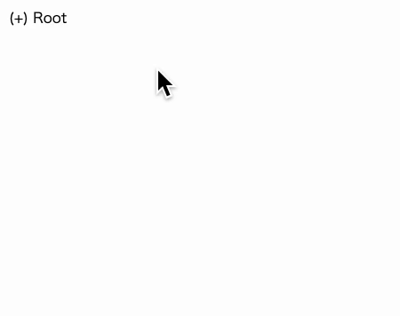

import Header from '../../../components/Header.astro'

<Header {...frontmatter} />

listitem要素とdetails要素を使うことで、HTMLだけでTreeView UIを実装できる。details要素のname属性を使うことで、排他的な開閉処理も可能だ。

```html
<details>
  <summary>Root</summary>
  <ul>
    <li>System</li>
    <li>
      <details>
        <summary>Applications</summary>
        <ul>
          <li>Calendar.app</li>
          <li>Contacts.app</li>
          <li>Mail.app</li>
          ...
        </ul>
      </details>
    </li>
    ...
  </ul>
</details>
```

```css
.treeview ul {
  list-style: none;
}

details > summary::marker {
  content: "(+) ";
}
details[open] > summary::marker {
  content: "(-) ";
}
```

## デモ

<section id="demo">
  <details class="treeview">
    <summary>Root</summary>
    <ul>
      <li>System</li>
      <li>
        <details>
          <summary>Applications</summary>
          <ul>
            <li>Calendar.app</li>
            <li>Contacts.app</li>
            <li>Mail.app</li>
          </ul>
        </details>
      </li>
      <li>
        <details>
          <summary>Users</summary>
          <ul>
            <li>root</li>
            <li>
              <details>
                <summary>user</summary>
                <ul>
                  <li>Applications</li>
                  <li>
                    <details>
                      <summary>Desktop</summary>
                      <ul>
                        <li>memo.txt</li>
                      </ul>
                    </details>
                  </li>
                  <li>
                    <details>
                      <summary>Documents</summary>
                      <ul>
                        <li>file.txt</li>
                        <li>image.png</li>
                      </ul>
                    </details>
                  </li>
                </ul>
              </details>
            </li>
          </ul>
        </details>
      </li>
    </ul>
  </details>
</section>

<style>{`
#demo {
  .treeview ul {
    list-style: none;
  }

  details > summary::marker {
    content: "(+) ";
  }
  details[open] > summary::marker {
    content: "(-) ";
  }
}

`}</style>



