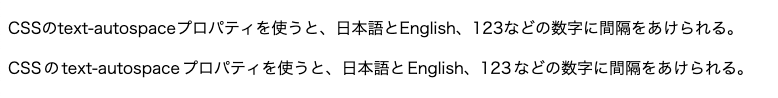

import Header from '../../../components/Header.astro'
import Baseline from '../../../components/Baseline.astro'

<Header {...frontmatter} />

国際化対応（Internationalization/i18n）の機能のひとつに[text-autospace](https://developer.mozilla.org/en-US/docs/Web/CSS/CSS_text)がある。

このプロパティは、日本語のように複数の文字体系（漢字、英語、数字など）を混在させて使う言語において、その間にスペースを開けることができる。

<Baseline featureId={"text-autospace"} />

```css
.autospace {
  text-autospace: normal;
  text-autospace: no-autospace;
}
```

現在、一部ブラウザでのみ使用でき、かつChromeとSafariではデフォルトの値が異なるため注意が必要だ。

- Chrome Canary: `text-autospace: no-autospace`がデフォルト値
- Safari Technology Preview: `text-autospace: normal`がデフォルト値

## デモ

<section id="demo">
  <p class="nospace">CSSのtext-autospaceプロパティを使うと、日本語とEnglish、123などの数字に間隔をあけられる。</p>
  <p class="autospace">CSSのtext-autospaceプロパティを使うと、日本語とEnglish、123などの数字に間隔をあけられる。</p>
</section>

<style>{`
.nospace {
  text-autospace: no-autospace;
}
.autospace {
  text-autospace: normal;
}
`}</style>


