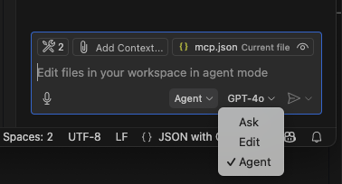
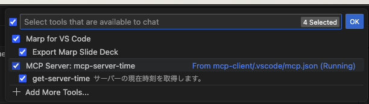
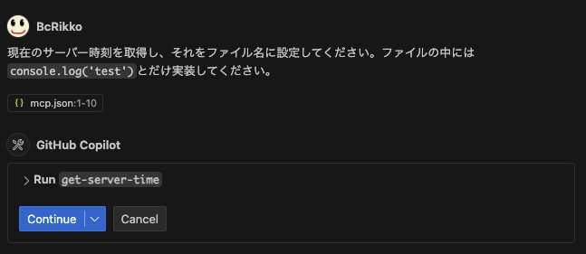
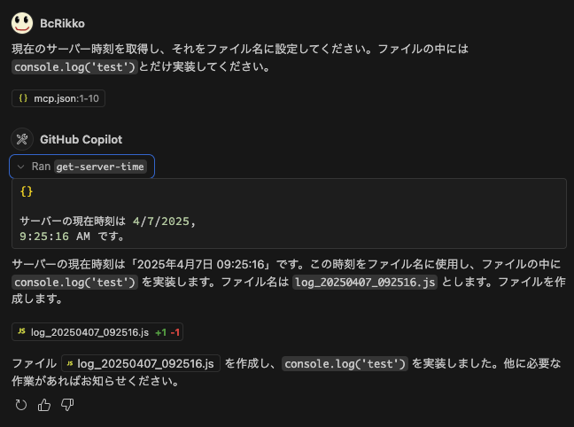

import Header from '../../../components/Header.astro'

<Header {...frontmatter} />

最近、AIアシスタントの文脈で「MCP」や「MCPサーバー」という用語を聞くようになった。

## MCP（Model Cotext Protocol）とは？

**[Model Context Protocol](https://modelcontextprotocol.io/)とは、AIとアプリケーションとの間で情報を効率的にやり取りするためのプロトコル。** 簡単に説明すると、AIが自分の作ったアプリケーションを操作できるように、データを提供したり、機能を公開したりして、扱いやすくするための方法を定義したもの（プロトコル）。

**MCPを使うことで、AIがアプリケーションのコンテキストを理解できるようになる。** たとえば、いままで手動でデータを貼り付けたり、プロンプトを書いてコンテキストを補っていたりしたものが、AIが直接アプリケーションから取得できるようになる。


### MCPサーバー

主に3つの機能を提供する。

- Resources … クライアントが読み取れるデータ
- Tools … LLMで呼び出すことができる関数
- Prompts …特定のタスクを実行するためのテンプレート

### MCPクライアント

MCPをサポートし、MCPサーバと通信するためのアプリケーションのこと。たとえばClaude DesktopやGitHub Copilot、Clineなどだ。

基本的にクライアントはエディタなどにお任せするので、自分たちで実装する機会は少ないかもしれない。


## MCPサーバーをつくる

[Model Cotext ProtocolというOrganization](https://github.com/modelcontextprotocol)で各言語をサポートしたSDKが公開されている。イチから自分で実装するのも良いが、現時点ではSDKを使うのが無難そう。

### 必要なパッケージのインストール

今回はNode.js + TypeScriptで最小構成のMCPサーバを開発するので、以下のパッケージをインストールする。

```bash
npm i @modelcontextprotocol/sdk
npm i -D typescript @types/node
```

```json
// package.json
{
  ...,
  "scripts": {
    "build": "tsc --outDir build",
  },
  ...,
}
```

### MCPサーバを実装する

サーバーの現在時刻を取得する簡単なMCPサーバーを実装する。
```ts
// src/index.ts
import { McpServer } from '@modelcontextprotocol/sdk/server/mcp.js'
import { StdioServerTransport } from '@modelcontextprotocol/sdk/server/stdio.js'

const server = new McpServer({
  name: 'server-time',
  version: '0.0.1',
  capabilities: {
    resources: {},
    tools: {},
  },
})

server.tool(
  'get-server-time',
  'サーバーの現在時刻を取得します。',
  {},
  async () => {
    return {
      content: [
        {
          type: 'text',
          text: `サーバーの現在時刻は ${new Date().toLocaleString()} です。`,
        },
      ],
    }
  },
)

async function main() {
  const transport = new StdioServerTransport()
  await server.connect(transport)
  console.log('Server is running...')
}

main().catch((error) => {
  console.error('Error starting server:', error)
  process.exit(1)
})
```

## MCPサーバーをつかう

次にVSCode + GitHub CopilotからMCPサーバーを使う。

別のディレクトリを作成し、`.vscode/mcp.json`に先ほど実装したMCPサーバーのパスを設定する。
```json
// ./vscode/mcp.json
{
  "servers": {
    "mcp-server-time": {
      "command": "node", // 場合によっては絶対パスで指定する
      "args": [
        "/ABSOLUTE/PATH/TO/PARENT/FOLDER/lab-mcp/build/index.js"
      ],
    }
  }
}
```

その後、VSCodeのインラインで`▷Start | 1 cached tools`と表示されているところをクリックして、サーバーを起動する。

次にGitHub Copilot Chatを開き、Agentモードに切り替える。



その後、レンチのアイコンをクリックし、MCPサーバーが使える状態になっているか確認する。




あとはChatで「現在のサーバー時刻を取得し、それをファイル名に設定してください。ファイルの中には`console.log('test')`とだけ実装してください。」のような指示をすると、MCPサーバーを呼び出し現在の時刻を取得してくれる。




