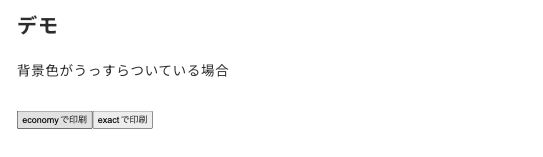
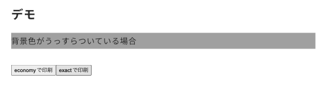

import Header from '../../../components/Header.astro'
import Baseline from '../../../components/Baseline.astro'

<Header {...frontmatter} />

[print-color-adjustプロパティ](https://developer.mozilla.org/en-US/docs/Web/CSS/print-color-adjust)を使うことで、出力端末上での外観を最適化できる。

よくあるウェブサイトのスタイルに「目に優しくするために背景色に真っ白（`#fff`）を避ける」というものがある。当TILブログも同様に真っ白を避け`#fafafa`を使っている。

ただ、そういったページを印刷すると無用なインクを消耗してしまう。そういったことに対処するために`print-color-adjust`プロパティがある。

<Baseline featureId={"print-color-adjust"} />

```css
body {
  /* 既定値:背景画像を取り除き印刷に最適化される */
  print-color-adjust: economy;
  /* 指定された色をそのまま印刷する */
  print-color-adjust: exact;
}
```

## デモ

<style>{`
#demo p {
  background-color: #aaa;
}
`}</style>

<script>{`
function printAdjust(mode) {
  const demo = document.querySelector('#demo')
  demo.style.printColorAdjust = mode
  print()
}
`}</script>

<section id="demo">
  <p>背景色がうっすらついている場合</p>

  <button type="button" onclick="printAdjust('economy')">economyで印刷</button>
  <button type="button" onclick="printAdjust('exact')">exactで印刷</button>
</section>

### print-color-adjust: economy



### print-color-adjust: exact


