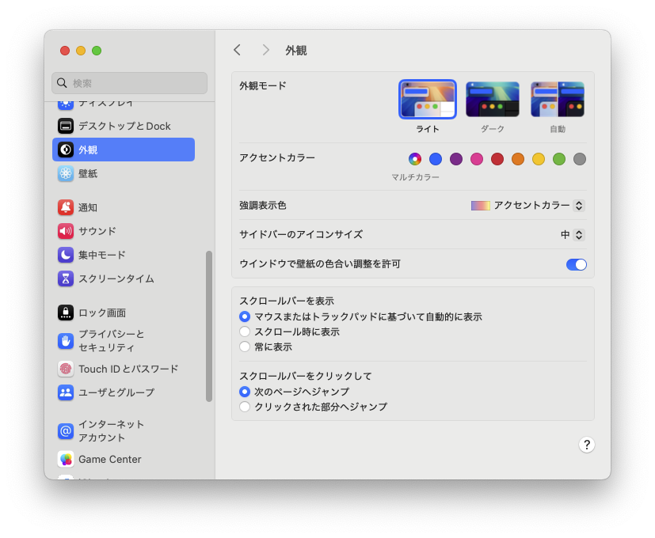
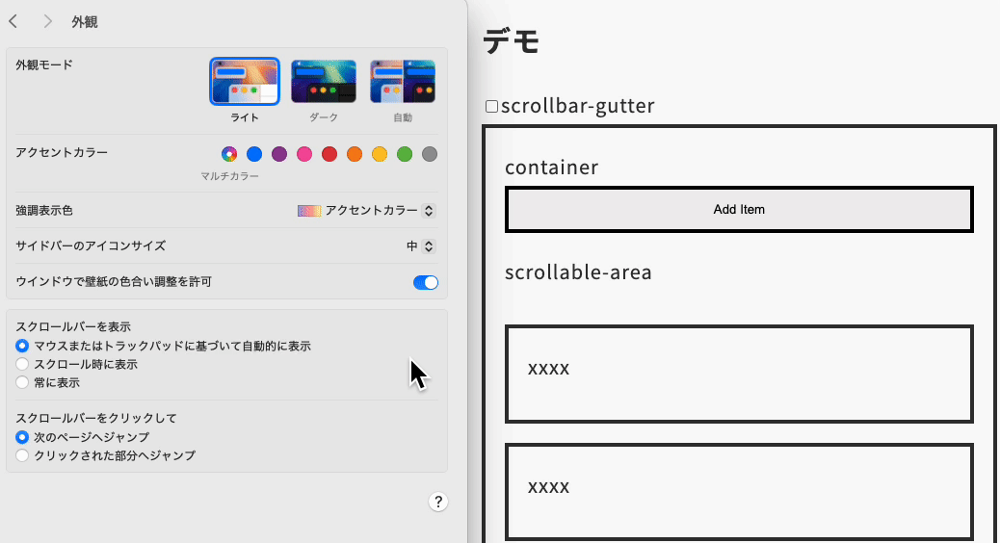
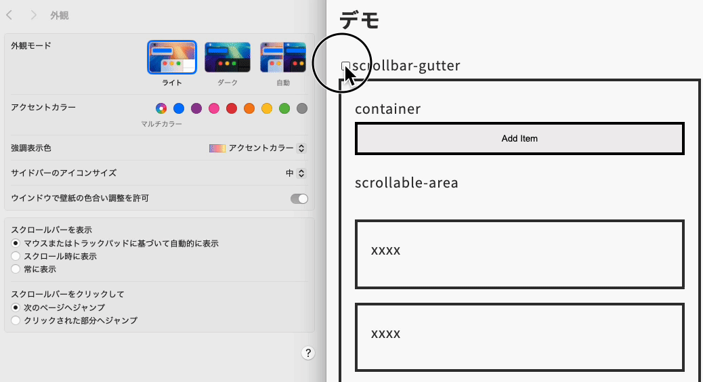

import Header from '../../../components/Header.astro'
import Baseline from '../../../components/Baseline.astro'

<Header {...frontmatter} />

ボタン付きのスタック型のコンポーネントで、スタック要素にスクロールバーが表示されるとき、OSの外観設定によってスタイルが崩れてしまう。

以下のようにスクロールバーが表示されることで、Scrollable AreaとButtonの幅がズレてしまう。
```plaintext
+----------------------------+
|           Button           |
+-------------------------+--+
|                         |  |
| <-- Scrollable Area --> |  |
|                         |  |
|                         |  |
|                         |  |
+-------------------------+--+
                 Scrollbar ┘
```

これはOSの外観設定でスクロールバーの表示/非表示（オーバーレイ）によるものだ。

 

## ブラウザ標準の挙動

「常に表示」の場合は、要素のwidthにスクロールバーの幅が含まれるのに対し、「スクロール時に表示」では含まれない。

```plaintext
▶常に表示の場合
+----------------------------+
|           Button           |
+-------------------------+--+
|                         |  |
| <-- Scrollable Area --> |  |
|                         |  |
|                         |  |
|                         |  |
+-------------------------+--+
                 Scrollbar ┘
```

```plaintext
▶スクロール時に表示の場合
+----------------------------+
|           Button           |
+----------------------------+
|                            |
| <--- Scrollable Area ----> |
|                            |
|                            |
|                            |
+----------------------------+
```

## scrollbar-gutterを使った場合

[scrollbar-gutterプロパティ](https://developer.mozilla.org/en-US/docs/Web/CSS/scrollbar-gutter)を使うことで、スクロールバーの幅をあらかじめ確保できるが、そうすると「スクロール時に表示」のときに余分なスペースができてしまう。

```plaintext
▶常に表示の場合
+----------------------------+
|           Button           |
+-------------------------+--+
|                         |  |
| <-- Scrollable Area --> |  |
|                         |  |
|                         |  |
|                         |  |
+-------------------------+--+
                 Scrollbar ┘
```

```plaintext
▶スクロール時に表示の場合
+----------------------------+
|           Button           |
+-------------------------+--+
|                         |
| <-- Scrollable Area --> |
|                         |
|                         |
|                         |
+-------------------------+
           scrollbar-gutter ┘
```

## デモ

<section id="demo">
  <input type="checkbox" id="gutter" />
  <label for="gutter">scrollbar-gutter</label>

  <section class="container">
    <button type="button" class="button" id="add">Add Item</button>
    <ul class="scrollable-area">
      <li class="item">xxxx</li>
      <li class="item">xxxx</li>
    </ul>
  </section>
</section>

<style>{`
#demo {
  input:checked ~ .container .scrollable-area {
    scrollbar-gutter: stable;
  }
  input:not(:checked) ~ .container .scrollable-area {
    scrollbar-gutter: auto;
  }

  :where(.container, .item, .button) {
    padding: 1em;
    border: solid 4px;
  }

  .container::before {
    content: "container"
  }

  .scrollable-area {
    padding: 0;
    height: 300px;
    overflow-y: auto;
    list-style: none;
    display: grid;
    gap: 1em;

    &::before {
      content: "scrollable-area"
    }
  }

  .item {
    border: solid 4px;
    padding: 1em;
  }

  .button {
    width: 100%;
  }
}
`}</style>

<script>{`
const addBtn = document.getElementById('add');
const list = document.querySelector('.scrollable-area');

addBtn.addEventListener('click', () => {
  const item = document.createElement('li');
  item.classList.add('item');
  item.textContent = 'xxxx';
  list.appendChild(item);
});
`}</script>

### scrollbar-gutter: autoの場合



### scrollbar-gutter: stableの場合



## まとめ

ユーザー環境に左右されない実装方法として、[scrollbar-width: none](https://developer.mozilla.org/en-US/docs/Web/CSS/scrollbar-width)を使ってスクロールバー自体を再実装する方法がある。"技術的には可能"だがなるべくやりたくない手法だ。

したがって、スクロールバーによるコンテンツの幅が変わる現象は「ユーザー環境によるもの」と割り切ってブラウザのデフォルトの挙動に寄せるのが良いと思う。
