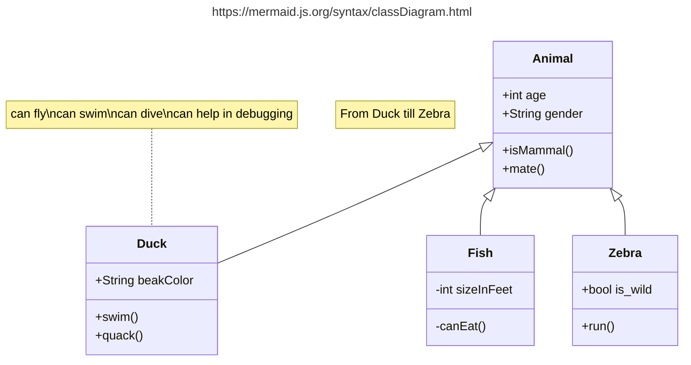

import Header from '../../../components/Header.astro'

<Header {...frontmatter} />

当ブログはAstro + mdxで構成されている。

図解するとき、いままではプレーンテキストでAAのような書き方をしていたが、書くのが大変なのでMermaid記法を使いたい。

```text
+--------+       +-------+
| User   |       | Admin |
+--------+ <|--- +-------+
| +name  |       |       |
| +email |       +-------+
+--------+
```

## AstroでMermaidを使う

AstroでMermaid記法を変換するためには、[rehype-mermaid](https://github.com/remcohaszing/rehype-mermaid)を使う。
```sh
npm i rehype-mermaid
```


```js
// astro.config.js
import rehypeMermaid from 'rehype-mermaid'
import { defineConfig } from 'astro/config'

export default defineConfig({
  ...,
  markdown: {
    syntaxHighlight: {
      type: 'shiki',
      excludeLangs: ['mermaid'],
    },
    rehypePlugins: [
      rehypeMermaid,
    ]
  }
})
```

## GitHub Actionsでビルドできようにする

rehype-mermaidはPlaywrightを使っているため、CI環境でヘッドレスブラウザのインストールが必要になる。

```sh
# playwright本体をインストールする
# ※ヘッドレスブラウザはビルドのステップでインストールする
npm i -D playwright
```

当ブログのBuild&DeployはGitHub Actionsの[withastro/action](https://github.com/withastro/action)を使っており、`npx playwright install --with-deps chromium`みたいなステップを追加することができない。

かといってnodeのセットアップなどを自分でやりたくないので、npm scriptsのprebuildを使ってブラウザをインストールする方法を採用した。

```json
{
  "scripts": {
    "prebuild": "npx playwright install --with-deps chromium",
    "build": "astro build"
  }
}
```

ブラウザの容量が大きいため、ビルド時間が1分ほど長くなってしまった…。

## Mermaid記法を試す

````


````


