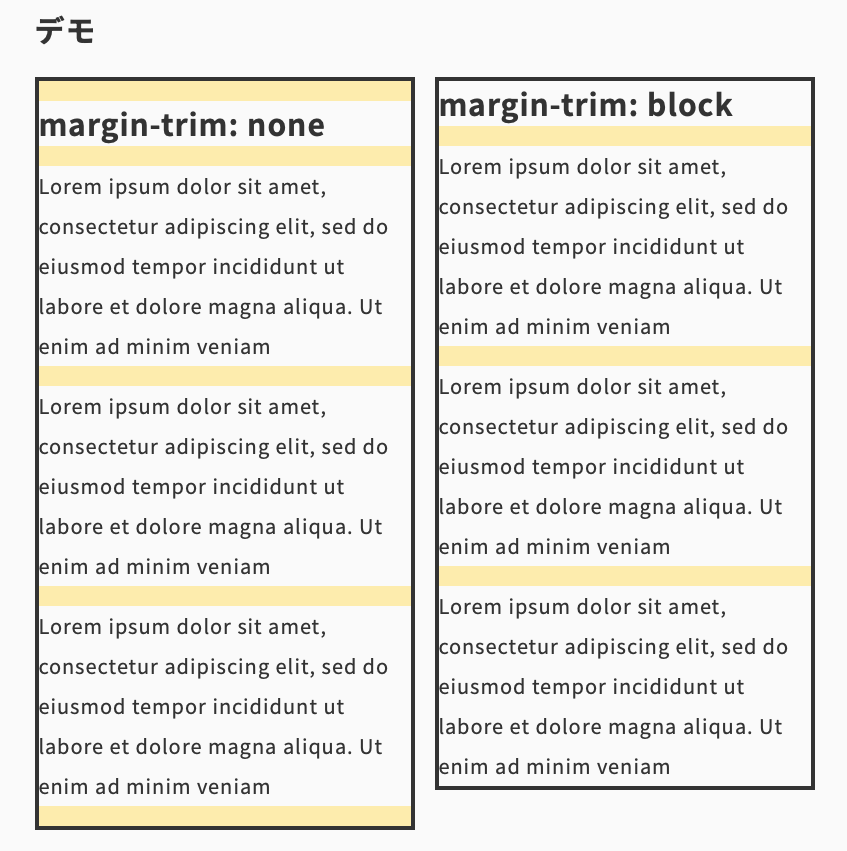

import Header from '../../../components/Header.astro'
import Baseline from '../../../components/Baseline.astro'

<Header {...frontmatter} />

[margin-trim](https://developer.mozilla.org/en-US/docs/Web/CSS/margin-trim)を使うことで、コンテナ要素の先頭と末尾のmarginを削除できる。

<Baseline featureId={"margin-trim"} />

p要素のように上下にmarginを持つ要素を並べるとき、marginの向きを一方向に制限し、かつmargin-topを使うなら先頭の要素の、margin-bottomを使うなら末尾の要素のmarginをresetする必要があった。

```css
/** margin-bottomに統一する場合 */
p {
  margin-bottom: 1rem;
}

p:last-child {
  margin-bottom: 0;
}

/** margin-topに統一する場合 */
p + p {
  margin-top: 1rem;
}
```

`margin-trim`を使うとblock、またはinline方向の最初と最後のmarginを削除できる。

```html
<section style="margin-trim: block">
  <p>...</p>
  <p>...</p>
  <p>...</p>
  ...
</section>
```

## デモ

※執筆時点では、Safariのみサポート。

<section id="demo">
  <section class="margin-trim" style="margin-trim: none;">
    <h2>margin-trim: none</h2>
    <p>Lorem ipsum dolor sit amet, consectetur adipiscing elit, sed do eiusmod tempor incididunt ut labore et dolore magna aliqua. Ut enim ad minim veniam</p>
    <p>Lorem ipsum dolor sit amet, consectetur adipiscing elit, sed do eiusmod tempor incididunt ut labore et dolore magna aliqua. Ut enim ad minim veniam</p>
    <p>Lorem ipsum dolor sit amet, consectetur adipiscing elit, sed do eiusmod tempor incididunt ut labore et dolore magna aliqua. Ut enim ad minim veniam</p>
  </section>
  <section class="margin-trim" style="margin-trim: block;">
    <h2>margin-trim: block</h2>
    <p>Lorem ipsum dolor sit amet, consectetur adipiscing elit, sed do eiusmod tempor incididunt ut labore et dolore magna aliqua. Ut enim ad minim veniam</p>
    <p>Lorem ipsum dolor sit amet, consectetur adipiscing elit, sed do eiusmod tempor incididunt ut labore et dolore magna aliqua. Ut enim ad minim veniam</p>
    <p>Lorem ipsum dolor sit amet, consectetur adipiscing elit, sed do eiusmod tempor incididunt ut labore et dolore magna aliqua. Ut enim ad minim veniam</p>
  </section>
</section>

<style>{`
#demo {
  display: flex;
  align-items: flex-start;
  gap: 1rem;

  h2, p {
    margin: 1rem 0;
    background-color: #fafafa;
  }

  .margin-trim {
    border: 4px solid;
    max-width: 40ch;
    background-color:rgb(255, 221, 85, .5)
  }
}
`}</style>



