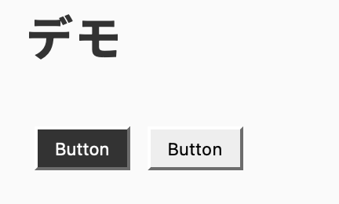

import Header from '../../../components/Header.astro'
import Baseline from '../../../components/Baseline.astro'

<Header {...frontmatter} />

[contrast-color()](https://webkit.org/blog/16929/contrast-color/)を使うことで、背景色にあわせてコントラスト比が適切な色（黒 or 白）を取得できる。

<Baseline featureId={"contrast-color"} />

```html
<button style="--bg-color: #333;">Button</button>
<button style="--bg-color: #eee;">Button</button>
```

```css
button {
  background-color: var(--bg-color);
  color: contrast-color(var(--bg-color));
}
```

## デモ

<section id="demo">
  <button style="--bg-color: #333;">Button</button>
  <button style="--bg-color: #eee;">Button</button>
</section>

<style>{`
#demo {
  button {
    background-color: var(--bg-color);
    color: contrast-color(var(--bg-color));
    padding: 0.5em 1em;
    margin: 0.5em;
  }
}
`}</style>




## WCAGに基づいたコントラスト比の計算

参考: [任意の背景色に対して読みやすい文字色を取得するSass functionを実装する \| Black Everyday Company](https://kuroeveryday.blogspot.com/2018/12/get-automatically-readable-font-color-with-sass.html)

[WCAG（Web Content Accessibility Guidelines）](https://www.w3.org/TR/WCAG20/)に、2色のコントラスト比を計算する方法が書かれている。


> **contrast ratio**  
> (L1 + 0.05) / (L2 + 0.05), where
> - L1 is the relative luminance of the lighter of the colors, and
> - L2 is the relative luminance of the darker of the colors.

> **relative luminance**  
> the relative brightness of any point in a colorspace, normalized to 0 for darkest black and 1 for lightest white
>
> Note 1: For the sRGB colorspace, the relative luminance of a color is defined as L = 0.2126 * R + 0.7152 * G + 0.0722 * B where R, G and B are defined as:
> - `if RsRGB <= 0.03928 then R = RsRGB/12.92 else R = ((RsRGB+0.055)/1.055) ^ 2.4`
> - `if GsRGB <= 0.03928 then G = GsRGB/12.92 else G = ((GsRGB+0.055)/1.055) ^ 2.4`
> - `if BsRGB <= 0.03928 then B = BsRGB/12.92 else B = ((BsRGB+0.055)/1.055) ^ 2.4`
>
> and RsRGB, GsRGB, and BsRGB are defined as:
> - RsRGB = R8bit/255
> - GsRGB = G8bit/255
> - BsRGB = B8bit/255


```ts
function getLuminance(color: number) {
  const i = color / 255
  return i <= 0.03928
    ? i / 12.92
    : ((i + 0.055) / 1.055) ** 2.4
}

function getTextColor(backgroundColor: string[]) {
  const [r, g, b] = backgroundColor

  const R = getLuminance(r)
  const G = getLuminance(g)
  const B = getLuminance(b)
  const Lbg = 0.2126 * R + 0.7152 * G + 0.0722 * B // Luminance of background color

  const Lw = 1 as const // Luminance of white
  const Lb = 0 as const // Luminance of black

  const Cw = (Lw + 0.05) / (Lbg + 0.05) // Contrast ratio of white
  const Cb = (Lbg + 0.05) / (Lb + 0.05) // Contrast ratio of black

  return Cw > Cb ? 'white' : 'black'
}
```
