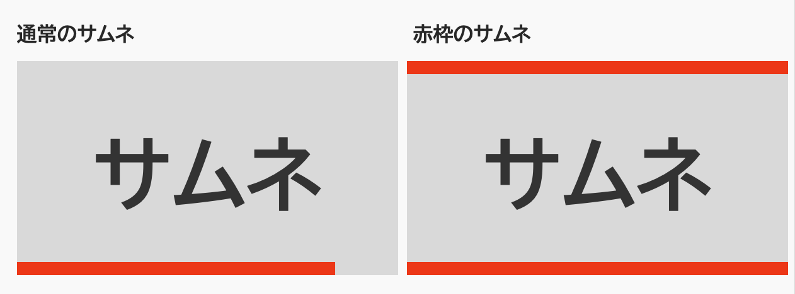
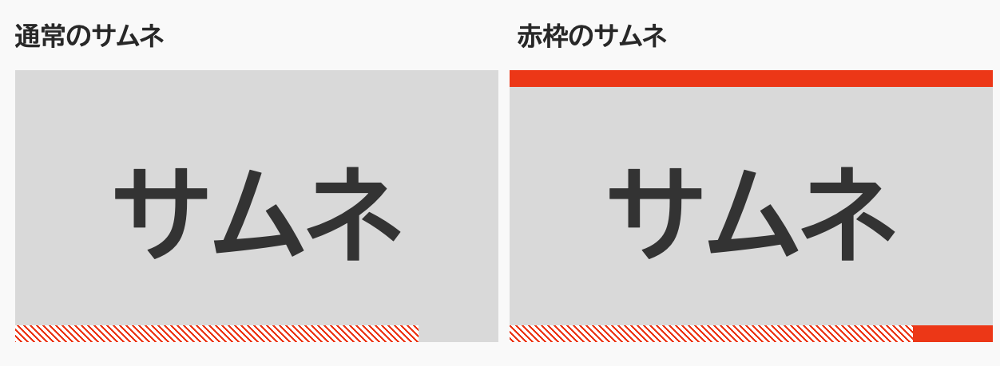

import Header from '../../../components/Header.astro'
import Baseline from '../../../components/Baseline.astro'

<Header {...frontmatter} />

YouTubeのサムネには、動画をどこまで見たかわかるように赤色のシークバーが表示されている。

しかし、「赤」は警告色で人の目を引くため、クリック率を増やしたい動画投稿者はサムネに赤色の枠をつけることが多々ある。そのため、YouTubeのシークバーがとサムネの色が被ってしまい、見えなくなる。




そこで、Chrome拡張の[Stylus](https://chromewebstore.google.com/detail/stylus/clngdbkpkpeebahjckkjfobafhncgmne?hl=ja)を使って、YouTubeのスタイルをカスタマイズして、シークバーを見やすくする。


```css
:is(
  .style-scope.ytd-thumbnail,
  yt-thumbnail-overlay-progress-bar-view-model
) {   
    height: 6px;
    z-index: 0;

    #progress, div > div {
        --c: #CC444B;
        --t: #E6C9C3;

        /* パターンをつかってシークバーの視認性を上げる */
        background: linear-gradient(
            45deg,
            var(--c) 25%,
            var(--t) 25%,
            var(--t) 50%,
            var(--c) 50%,
            var(--c) 75%,
            var(--t) 75%,
            var(--t)
        );
        background-size: 10px 10px;
    }
}
```


