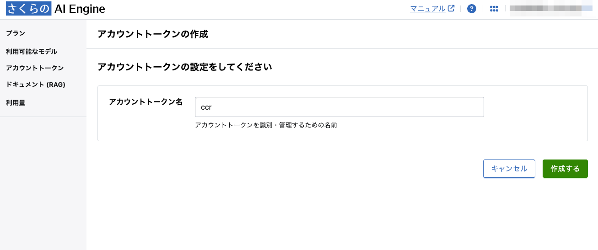
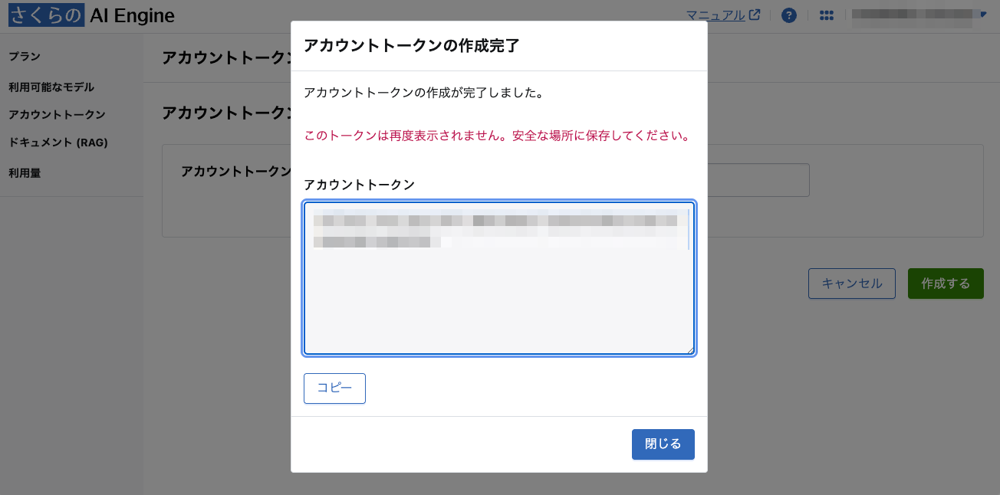

import Header from '../../../components/Header.astro'
import Baseline from '../../../components/Baseline.astro'

<Header {...frontmatter} />

Claude Codeは基本有料でPro/Maxプランでないと使えない。そのため利用を躊躇していた。

そんな中、[Claude Code Router](https://github.com/musistudio/claude-code-router) を使うことで自分の好きなプロパイダーで Claude Code を使えると知った。

また、つい先日リリースされた[さくらのAI Engine](https://www.sakura.ad.jp/aipf/)は、1ヶ月3,000リクエストまで無料で使えるということで、Claude Code Router + さくらのAI Engineを使ってAgentic Codingを体験してみた。


## Claude Code + Claude Code Routerのインストール

Claude Code と Claude Code Router をインストールする。
```sh
$ npm install -g @anthropic-ai/claude-code

$ npm install -g @musistudio/claude-code-router
```

次に、Claude Code Routerの設定ファイルを作成する。
```sh
cd ~
mkdir .claude-code-router
touch .claude-code-router/config.json
```

## さくらのAI EngineのAPIキーを取得する

[さくらのクラウド](https://secure.sakura.ad.jp/cloud)からログインし、AI Engineに移動する。

プランを選択し、契約してからアカウントトークンを取得する。





## Claude Code Routerの設定

`~/.claude-code-router/config.json`に、先ほど取得したAPIキーと利用するモデルを設定する。
```json
// .claude-code-router/config.json
{
  "Providers": [
    {
      "name": "sakura",
      "api_base_url": "https://api.ai.sakura.ad.jp/v1/chat/completions",
      "api_key": "<API_KEY>",
      "models": [
        "Qwen3-Coder-480B-A35B-Instruct-FP8",
        "gpt-oss-120b"
      ],
      "transformer": {
        "use": [
          [
            "languagePolicy",
            {
              "lang": "ja-JP"
            }
          ]
        ]
      }
    }
  ],
  "Router": {
    "default": "sakura,Qwen3-Coder-480B-A35B-Instruct-FP8",
    "background": "sakura,Qwen3-Coder-480B-A35B-Instruct-FP8",
    "think": "sakura,Qwen3-Coder-480B-A35B-Instruct-FP8",
    "longContext": "sakura,Qwen3-Coder-480B-A35B-Instruct-FP8",
    "longContextThreshold": 60000,
    "webSearch": "sakura,gpt-oss-120b",
    "image": ""
  }
}
```


## Claude Codeを動かしてみる

Claude Codeを直接ではなく、Claude Code Routerを介して実行する。

初回起動時は、Claude Code Router の説明やテーマの選択が表示されるが、以降はそのままプロンプトを入力して利用できる。
```text
$ ccr code

 ccr code
╭───────────────────────────────────────────────────╮
│ ✻ Welcome to Claude Code!                         │
│                                                   │
│   /help for help, /status for your current setup  │
│                                                   │
│   cwd: /path/to/repository                        │
│                                                   │
│   ─────────────────────────────────────────────── │
│                                                   │
│   Overrides (via env):                            │
│                                                   │
│   • API timeout: 600000ms                         │
│   • API Base URL: http://127.0.0.1:3456           │
╰───────────────────────────────────────────────────╯

> hello

⏺ Hello! How can I help you today?
```


## トラブルシューティング

Claude Code Router を使う際に、いくつかハマったことがあるので共有したい。

### プロバイダーが見つからない

以下のように、何度 `config.json` を編集してもプロバイダーが見つからないというエラーがでた。
```sh
$ ccr code
Provider 'sakura' not foundError: Provider  'sakura' not found
```

`config.json`を編集したら設定ファイルのリロードが必要なので、`ccr restart` を実行すると解決した。

### サービスが起動しない

いろいろ試していたらサービスが起動しなくなった。
```
$ ccr code
Service not running, starting service...
Service startup timeout, please manually run `ccr start` to start the service
```

どうやらすでに同じポート（デフォルトでは3456）で起動しているサービスがあった。

以下のようにLISTENしているプロセスを確認し、killコマンドを実行することで解決した。

```sh
$ lsof -i -P | grep "3456"
...
kill -9 <PID>
```
