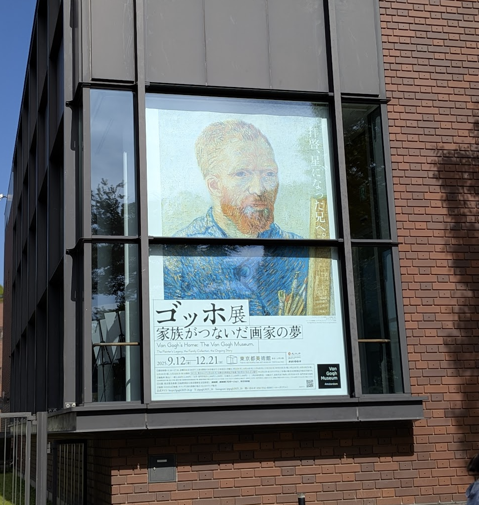
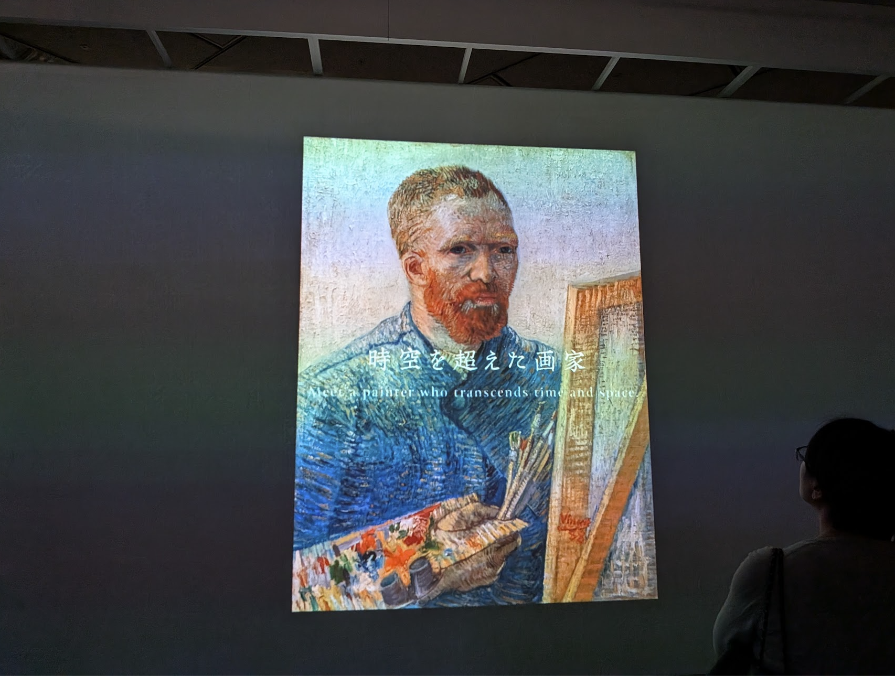
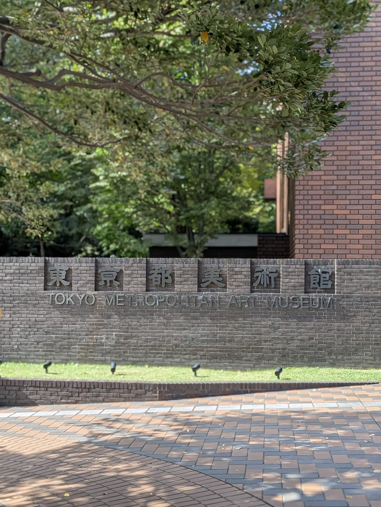

import Header from '../../../components/Header.astro'

<Header {...frontmatter} />

2025/09/12 〜 2025/12/21、上野の東京都美術館で[ゴッホ展 家族がつないだ画家の夢](https://www.tobikan.jp/exhibition/2025_vangogh.html)が開催されている。画家ゴッホを懇親的に支えた弟テオや、画家として評価されるよう奔走したテオの妻ヨーなど、ゴッホの家族にフォーカスして絵画や手紙を展示する展覧会だ。

筆者は、ゴッホについて「ひまわり」「星月夜」「自画像」など有名作品程度しか知らないので、展覧会を楽しむためにも予習したい。

※ 事前知識なしでも十分楽しめる内容だったので、気軽に足を運んでほしい。

## フィンセント・ファン・ゴッホの基本情報

<dl>
  <dt>名前</dt>
  <dd>
    フィンセント・ヴィレム・ファン・ゴッホ（Vincent Willem van Gogh）  
    「van Gogh」とは「ゴッホ家の〜」という意味
  </dd>

  <dt>出身地</dt>
  <dd>オランダ</dd>

  <dt>生年月日</dt>
  <dd>1853年3月30日</dd>

  <dt>没年月日</dt>
  <dd>1890年7月29日（37歳没）</dd>
</dl>

## ゴッホのエピソード

### 聖職者から画家へ
- 父が牧師だったため、牧師や伝道師を目指すが、信仰心が過激すぎると見なされ失職し、27歳で画家を志す
- 我が強く扱いづらい性格だった
- 自分の持っているモノをすべて労働者に与えてしまう ≒ 信仰心が過激だと見なされる
- 27〜37歳までの10年で油彩やデッサンなど2,000点の作品を制作する

### 画のスタイル

|時期|特徴|代表作|
|---|---|---|
|オランダ時代: 〜1885年頃|暗く重厚な色調で農民画など労働や信仰がテーマ|ジャガイモを食べる人々（1885）|
|南フランス時代: 1886〜1888年|印象派や日本の浮世絵に影響を受け、明るい色彩の作品が増えた|モンマルトル 風車と菜園（1887） 浜辺の漁船（1888） 種まく人（1888）|
|療養時代: 1889〜1890年|激しい筆致と鮮やかな色彩|ひまわり（1888） 星月夜（1889） 花咲くアーモンドの木の枝（1890）|

### 当時の時代背景

- 19世紀後半の時代背景は、産業革命が進み、経済格差が拡大していた
- キリスト教的な価値観から人間中心に転換する時期
- 写実的な表現から、光や影を捉える印象派が登場した
- ゴッホの時代では、自然描画ではなく感情表現をするポスト印象派になった
- パリでは日本美術（浮世絵）が流行していた
- 精神病院に入れる ≒ 社会からの排除 のような扱い

### 最期
- 37歳に麦畑で胸を打ち抜き、2日後に死去した
- ゴッホの死後の半年後に弟テオも病死した
- ゴッホと弟テオの墓石は隣同士に並んでいる

## ゴッホと家族の関係

- 弟テオ
  - ゴッホの理解者で、経済的にも精神的にも支え続けた
  - ゴッホは生前無名だったため、ほぼニート状態の兄に仕送りを続けた
  - 頻繁に手紙をやりとりしていた
- テオの妻ヨー
  - ゴッホ死後、画家としての評価を高めるために奔走した
  - 作品を収集・管理し、展覧会を開催したり、世界中に作品が広まるように活動した
- テオの息子フィンセント
  - ゴッホの名前を受け継いだ
  - 「花咲くアーモンドの木の枝」は、フィンセントに贈られた作品
  - ゴッホの作品を保存・展示する活動を行った

## 行ってみた感想

- ゴッホの作品以外に、当時の他の画家の作品が多く展示されていた
- オランダ時代、南フランス時代、療養時代の画風の違いがよくわかった
  - 明らかに「影響を受けた」ことが伝わってきた
- 手紙やノートの字がキレイだった
- 100年前から家計簿（現金出納帳）のフォーマットは同じだった
- 木口木版・活版印刷で濃淡が表現されているのが衝撃的だった
- 油彩の実物を見ると絵の具が乗せられている様子がわかり立体的で迫力があった
- 事前知識がなくても十分楽しめるようにガイドがあった

