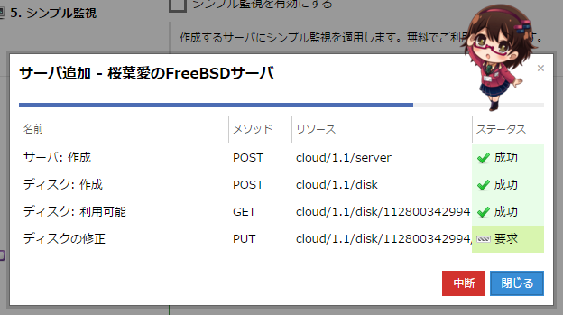

import Header from '../../../components/Header.astro'

<Header {...frontmatter} />

2025年11月1日、さくらインターネットにフロントエンドエンジニアとして入社してから10年がたった。

これまでに[失敗したことや迷惑をかけたこと](https://kuroeveryday.blogspot.com/2019/12/how-to-delete-all-in-the-production-environment.html)も多々あったが、振り返ってみると求められている以上の成果を出せたのではないかと自負している。

ということで、この10年間で取り組んできた活動を振り返る。

## 🚩 フロントエンドの開発環境のモダン化

面接のときに「JavaScriptで書かれていてメンテしづらい。TypeScript化してくれる人を探している。」と伺った。当時から個人でTypeScriptをつかったアプリケーションを開発していたので、最初の使命となった。

- **Prototype.jsの削除**
  - 10年前、さくらのクラウドは ES3 + Prototype.js で実装されていた
  - Prototype.js は Prototype を拡張するため TypeScript と相性が悪く障害となった
- **ES3 から ES2015（ES6） への移行**
  - Babelを導入し、新しい構文を使えるようにした
  - バンドラー（webpack）やタスクランナー（gulp）を導入し、モダンな開発環境を整備した
- **TypeScript化**
  - JavaScriptで書かれた数万行のコードをTypeScriptに移行した
  - anyだった型を、バックエンドエンジニアの協力を仰ぎながらひとつずつ型定義した
- **jQuery + 独自UIライブラリからモダンなフレームワークへ**
  - Viewとロジックが密結合していた
  - Vue.jsを導入し、設計的な課題を解決しながら再利用可能なコンポーネントを開発した

## 🚩 フロントエンド開発のリード

入社して数年間は、1年先輩のエンジニアと2人体制でフロントエンド開発を担当していた。メンバーが増えてからは開発をリードすることが増えた。

- **ドメインオブジェクトの導入**
  - Viewとロジックが密結合しており、仕様がわかりづらく再利用が難しかった
  - ドメインオブジェクトを追加し、ロジックや仕様を集約するような設計を追加した
- **パフォーマンス改善**
  - ページ表示まで10秒かかっていた処理を、3秒未満まで短縮した
  - ロードの最適化、データのキャッシュ、グローバル変数の管理など
- **UIのリニューアル/リアーキテクチャ**
  - 根本的な問題を解決するために、UIの実装を大幅にリニューアルした
  - DDDやClean Architectureを参考に、設計を見直し、保守性・柔軟性を向上させた
  - 型を重視し、不明瞭な状態を排除した
- **社内用ライブラリの開発**
  - DNSレコードパーサー（JSON ↔ DNSレコード）
  - UIライブラリ
  - APIクライアント
  - eslintなどのルールセット
  - など

## 🚩 デザイナーとの協業

もともとさくらのクラウドにはデザイナーがいなかった。UIをリニューアルするにあたりデザイナーが加わったので、協業体制の構築に取り組んだ。

- **デザイナーチームとの関係構築**
  - デザイナーとフロントエンドエンジニアのコミュニケーションを円滑にするため、デザイナーが主催する勉強会に毎週ひとりで参加し、関係性を築いた
- **UXやデザインシステムの理解**
  - デザイナーと同じ視点で議論できるように、UXやデザインシステムを学んだ
  - コンポーネント設計やUXライティングの勉強会を開き、知見を共有した

## 🚩 文化醸成とスキルアップ施策

一気に文化を変えると反発を生む。そのため、協力者を増やし、時間をかけて文化を醸成していった。また、その過程で自分も含め、社員のスキルアップを促進した。

- **UI軽視からの脱却**
  - 「作業依頼」から「課題の共有」に変える
  - 初期段階からデザイナーやフロントエンドエンジニアを巻き込んでもらうための働きかけをした
- **アクセシビリティの重要性の発信**
  - いまほど注目されていなかった頃から、アクセシビリティの重要性を社内に発信してきた
  - 「こちらリンク撲滅委員会」や「セマンティックマークアップ警察」など
- **社内への情報発信・学びの共有**
  - 自身のtimesチャンネルをフロントエンドニュースチャンネル化し、最新情報や学びを共有した
  - [当ブログ](https://bcrikko.github.io/til/)は times で共有した内容のコピー
- **勉強会、読書会、交流会の企画・運営**
  - [社内勉強会やっていきガイド](https://speakerdeck.com/bcrikko/tips-for-sustainable-study-groups)
  - 横のつながりをつくる環境づくり
  - 勉強会をやろうとしている人のサポート
  - 交流会
    - フロントエンド交流会（200回以上開催）
    - のちにバックエンドエンジニアに相談し、バックエンド交流会を発足
  - 読書会
    - エリック・エヴァンスのドメイン駆動設計
    - ソフトウェアのテスト技法
    - Tidy First?
    - など
  - 勉強会
    - [知ってトクするDevToolsの使い方](https://speakerdeck.com/bcrikko/devtools-tips-you-should-know)
    - [伝わるバグ報告](https://speakerdeck.com/bcrikko/how-to-write-a-better-bug-report)
    - [言葉をデザインするUXライティング](https://speakerdeck.com/bcrikko/10-rules-of-effective-ux-writing)
    - [コンポーネント指向時代のmargin戦略](https://speakerdeck.com/bcrikko/rethinking-the-relationship-between-components-and-margins)
    - [加速するコンポーネント設計入門](https://speakerdeck.com/bcrikko/component-design-as-an-accelerator)
    - [がんばりすぎないAI活用 & Tips](https://speakerdeck.com/bcrikko/working-with-ai)
    - ソフトウェア設計（非公開）
    - などなど

## 🚩 フロントエンドのイメージがない弊社のなんちゃって広報活動

弊社はサーバーインフラの会社というイメージが強く、在籍しているデザイナーやフロントエンドエンジニアの認知度が低い。とくに業務上求められてはいないが、自分なりにフロントエンドエンジニアとしてなんちゃって広報活動をしてきた。

### エイプリルフール
- **2016年: 音声通知機能**
  - 弊社の2次元社員である桜葉愛がコンパネ上でおしゃべりする機能を企画・開発。
  - [サーバ作成や起動完了を桜葉愛がお知らせする「音声通知機能」のΩ版提供を開始しました? \| さくらのクラウドニュース](https://cloud.sakura.ad.jp/news/2016/04/01/aprilfool-release/)
  - 
- **2017年: さくらのおみくじ**
  - ログイン画面でおみくじが引ける機能を企画・開発。
  - <blockquote class="twitter-tweet">
こんにちは～(｡◕ ∀ ◕｡) クラウドのログイン画面に「さくらのおみくじ」ができましたので 引いてみましたよ～♪<a href="https://t.co/wv2w9jqJsw">https://t.co/wv2w9jqJsw</a><a href="https://twitter.com/hashtag/%E3%81%95%E3%81%8F%E3%82%89%E3%81%AE%E3%81%8A%E3%81%BF%E3%81%8F%E3%81%98?src=hash&amp;ref_src=twsrc%5Etfw">#さくらのおみくじ</a>　<a href="https://twitter.com/hashtag/%E5%85%88%E5%8F%96%E3%82%8A%E3%82%A8%E3%82%A4%E3%83%97%E3%83%AA%E3%83%AB%E3%83%95%E3%83%BC%E3%83%AB?src=hash&amp;ref_src=twsrc%5Etfw">#先取りエイプリルフール</a> <a href="https://t.co/mD3MrCygkW">pic.twitter.com/mD3MrCygkW</a>
&mdash; まりな🌸さくらインターネット公式 (@sakura_ope) <a href="https://twitter.com/sakura_ope/status/847654599372689408?ref_src=twsrc%5Etfw">March 31, 2017</a></blockquote>
- **2018年: さくらのINFRA WARS**
  - インフラエンジニア育成型サーバー防衛シミュレーションゲームの企画・開発。
  - 一般公開は終了したけど、フロントエンド系イベントの弊社ブースでたまに公開しているらしい。
  - <blockquote class="twitter-tweet">
【プレスリリース】サイバー攻撃に対抗できる人材育成を目指し、インフラエンジニア育成型サーバー防衛シミュレーション「さくらのINFRA WARS」プログラムを提供開始！プレスリリース詳細はPDFをご覧ください！ <a href="https://twitter.com/hashtag/%E3%82%A8%E3%82%A4%E3%83%97%E3%83%AA%E3%83%AB%E3%83%95%E3%83%BC%E3%83%AB?src=hash&amp;ref_src=twsrc%5Etfw">#エイプリルフール</a><a href="https://t.co/q6YYLwyCYc">https://t.co/q6YYLwyCYc</a> <a href="https://t.co/EViTz7EoN5">pic.twitter.com/EViTz7EoN5</a>
&mdash; 【公式】さくらインターネット (@sakura_pr) <a href="https://twitter.com/sakura_pr/status/980098490817630208?ref_src=twsrc%5Etfw">March 31, 2018</a></blockquote>
  - [「さくらのINFRA WARS」を支える技術をご紹介！　さくらの勉強会 フロントエンドナイト レポート \| さくらのナレッジ](https://knowledge.sakura.ad.jp/16997/)

### アプリケーションの開発

- **さくらのクラウド用Slack bot**
  - Slack上でbotと対話しながらサーバー作成などができるbotを開発
  - [Slack上からさくらのクラウドを操作できるbotをつくった \| Black Everyday Company](https://kuroeveryday.blogspot.com/2016/04/slack-sacloud-bot.html)
- **さくらのクラウド用APIクライアント**
  - ブラウザ上でさくらのクラウドのAPIを試せるアプリケーションを開発
  - [Vue\.js\+Vuex、Express4、Dockerなどを使ってさくらのクラウドのAPIクライアントを作った \| Black Everyday Company](https://kuroeveryday.blogspot.com/2016/12/sacloud-api-tester.html)
- **サービスメニューのChrome拡張機能**
  - 横断的にさくらの各サービスへ横断的にアクセスできるChrome拡張を開発
  - <blockquote class="twitter-tweet">
【お知らせ】Chrome拡張機能「さくらのコントロールパネルリンク」を提供開始しました！ さくらのサービスの各コントロールパネルに素早くログインできます。様々なサービスをご利用くださっている方はぜひお試しくださいね！<a href="https://t.co/tooS3himX4">https://t.co/tooS3himX4</a> <a href="https://t.co/w6HVWxcMRa">pic.twitter.com/w6HVWxcMRa</a>
&mdash; 【公式】さくらインターネット (@sakura_pr) <a href="https://twitter.com/sakura_pr/status/866518940159049728?ref_src=twsrc%5Etfw">May 22, 2017</a></blockquote> 

### 情報発信

- **オウンドメディアへの寄稿**
  - 著者ページ: [ダーシノ \| さくらのナレッジ](https://knowledge.sakura.ad.jp/author/bc_rikko/)
- **個人ブログ・スライドでの発信**
  - [Today I learned\. \| @bc\_rikko](https://bcrikko.github.io/til/)
  - [Black Everyday Company](https://kuroeveryday.blogspot.com/)
  - [ダーシノ \(@bcrikko\) on Speaker Deck](https://speakerdeck.com/bcrikko)
- **登壇**
  - さくらの勉強会:
    - [ゲーム開発初心者が教えるブラウザゲームのつくり方](https://speakerdeck.com/bcrikko/how-to-make-games-javascript)
    - [伝わるバグ報告](https://speakerdeck.com/bcrikko/how-to-write-a-better-bug-report)
    - [フロントエンドの複雑さに立ち向かう](https://speakerdeck.com/bcrikko/tackling-complexity-of-front-end-software-with-ddd-and-clean-architecture)
  - Meguro.css:
    - [CSSだけでウェブサイトをドット化する方法](https://speakerdeck.com/bcrikko/how-to-pixelize-a-website-using-only-css)
  - UIT meetup:
    - [本気でCSS芸やりたい人のためのbox\-shadow講座](https://speakerdeck.com/bcrikko/mastering-box-shadow)
    - [ep\.23 UIT meetup 「集まれ！（タブン）実務では使わないフロントエンド芸発表会」 After show \| UIT INSIDE](https://uit-inside.linecorp.com/episode/23)
  - フロントエンドカンファレンス:
    - [存在感が薄い?\!意外とがんばってるさくらインターネットFEチーム](https://speakerdeck.com/bcrikko/frontend-conference-2024)
  - 現場から学ぶモデル駆動の設計:
    - [フロントエンドのモデル駆動設計](https://modeling-how-to-learn.connpass.com/event/308018/)

### 外部メディア掲載・インタビュー

- Software Design
- [ASCII\.jp：心が躍るファミコン風CSSフレームワーク「NES\.css」の誕生秘話に迫る](https://ascii.jp/elem/000/001/843/1843468/)
- [Release Radar · December 2018 \- The GitHub Blog](https://github.blog/open-source/release-radar-december-2018/#nes-css-1-0)
- [仮想DOMは本当に“速い”のか？ DOM操作の新しい考え方を、フレームワークを実装して理解しよう｜アンビ（AMBI）](https://en-ambi.com/itcontents/entry/2020/02/18/103000/)
- [世界4位のCSSフレームワークを生み出したダーシノが副業やOSS活動に打ち込む理由 \| Offers Magazine](https://offers.jp/media/sidejob/workstyle/a_1769)
- [無料で使えるかわいい8bitデザインのファミコン風CSSフレームワーク「NES\.css」 \- GIGAZINE](https://gigazine.net/news/20210204-nes-css/)
- [CSS嫌いがあえてフレームワークまでつくった理由。　NES\.css開発者流、「嫌い」を「好き」に変える勉強術【フォーカス】 \| レバテックラボ（レバテックLAB）](https://levtech.jp/media/article/focus/detail_420/)
- [高齢の母のために作った「インターネットにつながらなくなったら開ける箱」が話題に　どんな仕組み？「これで不安がなくなる」｜まいどなニュース](https://maidonanews.jp/article/15283617)
- [まとめ \| @bc\_rikko](https://bcrikko.github.io/til/aboutme/)

## さいごに

この記事では自分のアピールできるポイントしか書いておらず、具体的な失敗談などは省いている。まわりに迷惑をかけたり、上司に ~~愚痴~~ 相談したり、いろいろあったが、この10年間で多くの人に影響を受けながら成長できたと思う。

なお、現在絶賛キャリア迷子中なので、次の10年に向けて「フロントエンドエンジニア」という枠にとらわれずに新たなチャレンジをしていきたい。
