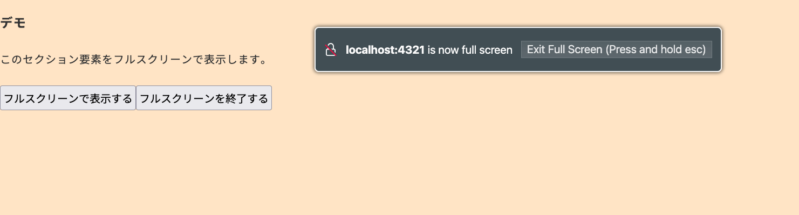

import Header from '../../../components/Header.astro'

<Header {...frontmatter} />

Webページの特定のエリアのみをフルスクリーンで表示したい場合、[Element#requestFullscreen()](https://developer.mozilla.org/en-US/docs/Web/API/Element/requestFullscreen)を使う。逆にフルスクリーンを終了するには[Document#exitFullscreen()](https://developer.mozilla.org/en-US/docs/Web/API/Document/exitFullscreen)を使う。

また一部ブラウザではあるが、options引数でナビゲーションUIの表示やキーボードロックを有無を指定できる。

```js
// フルスクリーンで表示する要素
const target = document.querySelector('#target')

try {
  await target.requestFullscreen({
    navigationUI: "hide",
    keyboardLock: "browser"
  })
} catch (err) {
  console.error(`フルスクリーンのリクエストに失敗: ${err.message}`)
}

// フルスクリーンを終了する
try {
  await document.exitFullscreen()
} catch (err) {
  console.error(`フルスクリーンの終了に失敗: ${err.message}`)
}
```

## Options

### navigationUI

フルスクリーンにしたときに、ブラウザのナビゲーション（URLバーやBackボタンなど）を表示するか指定する。 **ただしJavaScriptからブラウザに要求するだけで、実際にナビゲーションUIを表示するかどうかはブラウザの実装に委ねられる。**

- auto: ブラウザが必要に応じてナビゲーションUIを表示する（デフォルト）
- hide: ナビゲーションUIを常に非表示にする
- show: ナビゲーションUIを常に表示する

### keyboardLock

フルスクリーンにしたときに、一部のキーボード操作をロックするか指定する。たとえば「ブラウザゲームにおいてESC押下でフルスクリーンを終了させたくない」などの用途で使われる。

- none: キーボードロックなし（デフォルト）
- browser: ブラウザやOSが使う特定のキーをロックする

ただし、執筆時点（2026年5月）では[Firefox 151](https://developer.mozilla.org/en-US/docs/Mozilla/Firefox/Releases/151)でのみサポートされている。Chrome系は[Keyboard Lock API](https://developer.mozilla.org/en-US/docs/Web/API/Keyboard/lock)で対応が必要。


FirefoxでkeyboardLockオプションを指定するとフルスクリーン時に「Exit Full Screen (Press and hold esc)」と表示される。




## デモ

<section id="demo">
  <p>このセクション要素をフルスクリーンで表示します。</p>
  <p>keyboardLockオプションをサポートしているブラウザでフルスクリーンを終了する場合は、「フルスクリーンを終了する」ボタンか、ESCキーを長押ししてください。</p>

  <button type="button" id="requestFullscreen">フルスクリーンで表示する</button>
  <button type="button" id="exitFullscreen">フルスクリーンを終了する</button>
</section>

<style>{`
#demo {
  background-color: bisque;
}
`}</style>

<script>{`
const demo = document.querySelector('#demo')

demo.querySelector('#requestFullscreen').addEventListener('click', async () => {
  try {
    await demo.requestFullscreen({
      navigationUI: "hide",
      keyboardLock: "browser"
    })
  } catch (err) {
    console.error('フルスクリーンのリクエストに失敗: ' + err.message)
  }
})

demo.querySelector('#exitFullscreen').addEventListener('click', async () => {
  try {
    await document.exitFullscreen()
  } catch (err) {
    console.error('フルスクリーンの終了に失敗: ' + err.message)
  }
})

`}</script>
