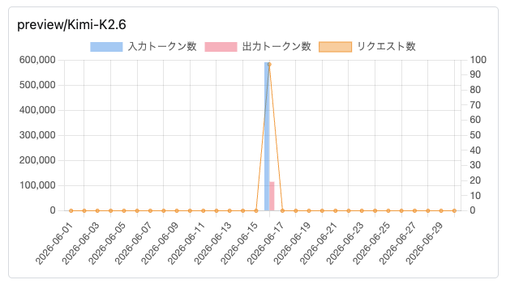

import Header from '../../../components/Header.astro'

<Header {...frontmatter} />

[OpenCodeReview](https://github.com/alibaba/open-code-review)は、Alibabaが公開しているAIレビューツールだ。

※中国系企業のため、企業によっては情報セキュリティポリシーにより利用できない場合があるので、その点は各自判断してほしい。私の場合は、 **オープンソースとして実装内容を確認できること、利用するLLMプロバイダーを選択できることから許容できるリスク水準と判断し利用した。**

LLM Providerを自由に選択できるため、無料枠で利用できる[さくらのAI Engine](https://ai.sakura.ad.jp/sakura-ai/)を使う。

なお、さくらのAI Engineのアクセストークン取得方法は、[Claude Code \+ さくらのAI EngineではじめるAgentic Coding](https://bcrikko.github.io/til/posts/2025-09-30/claude-code-with-ai-engine/)を参照してほしい。

## インストールと環境設定

OpenCodeReviewをnpmでglobalにインストールする。他にもGitHubからソースコードをダウンロードして自前でビルドすることもできる。インストールが終わると`ocr`コマンドが使えるようになる。
```sh
$ npm install -g @alibaba-group/open-code-review
```

環境設定を行う際、対話式のコマンドが推奨されているが、その中にさくらのAI Engineは選択肢として表示されないため、直接設定ファイルを作成する。

```sh
$ cd ~

# .opencodereviewディレクトリを作成する
$ mkdir .opencodereview
$ cd .opencodereview

# config.jsonを作成する
touch config.json
vim config.json
```

執筆時点（2026年6月）で、Messages APIをサポートしているモデルは`preview/Kimi-K2.6`のみのため、設定ファイルは以下のようにする。

```json
{
  "llm": {
    "url": "https://api.ai.sakura.ad.jp/v1/messages",
    "auth_token": "<API_KEY>",
    "model": "preview/Kimi-K2.6"
  }
}
```

- `url`: Messages APIのエンドポイント
- `auth_token`: さくらのAI Engineのアクセストークン
- `model`: 利用するモデル（執筆時点では`preview/Kimi-K2.6`のみ）

設定が終わったらAPIの疎通確認を行う。
```sh
$ ocr llm test
Source: OCR config file
URL:    https://api.ai.sakura.ad.jp/v1/messages
Model:  preview/Kimi-K2.6
```

## OpenCodeReviewで自動レビューする

`ocr review`コマンドを実行することで、自動的にレビューしてくれる。オプションはいろいろあるが、PullRequestを出す前のセルフレビューとして使いたかったので、`--from`（マージ先ブランチ）と`--to`（作業を行っているfeatureブランチ）を指定して実行する。

なお、**CLIで実行するため、出力結果が多いとターミナルのスクロールバックバッファを超えてしまう場合があるので、ファイルに出力するなり、後続のAI AgentのCLIツールにパイプするなりして、出力結果を活用するのが良い。**

試しに実行した環境では、`diff +657 -99`程度の変更に対して、私の環境では12〜13分ほどかかり、8つ指摘があった。
```sh
$ cd  /path/to/your/repository

$ ocr review --from main --to feat/your-branch > review.txt

[ocr] Summary: 22 file(s) reviewed, 8 comment(s), ~694695 token(s) used (input: ~587763, output: ~106932), 11m14s elapsed

─── src/sample/index.ts:97-97 ───
...

-       if (input !== undefined) {
+       if (input) {
```

今回のレビューでは694,695トークン消費したため、従量課金で使うには注意が必要だ。




## レビュー結果をAI Agentで修正する

出力されたレビュー結果を、Claude CodeやGitHub Copilot Agentに渡すことで、自動的に修正してくれる。

ただし、**リポジトリの環境設定をすべて読み込んでレビューするわけではないため、Linterルールやコーディングガイドラインを無視した指摘がある。そのため、修正箇所は1件ずつ目視で確認し、コミットするかどうかの判断が必要になる。**
