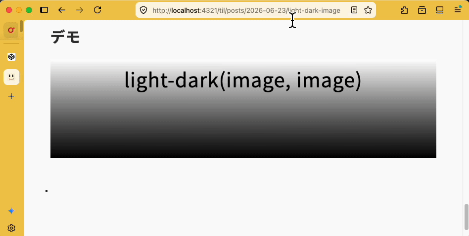

import Header from '../../../components/Header.astro'
import Baseline from '../../../components/Baseline.astro'

<Header {...frontmatter} />

ライトモードとダークモードの切り替えに値を変更する[`light-dark()`](https://developer.mozilla.org/en-US/docs/Web/CSS/Reference/Values/color_value/light-dark)に、imageを指定することでモードにあわせた画像切り替えができるようになった。

※執筆時点（2026年6月）ではFirefox 150、Safari TP 246のみサポート

<Baseline featureId={"light-dark-image"} />

## 従来の画像切り替え

いままでは、[picture要素](https://developer.mozilla.org/en-US/docs/Web/HTML/Reference/Elements/picture)やメディアクエリの[prefers-color-scheme](https://developer.mozilla.org/en-US/docs/Web/CSS/Reference/At-rules/@media/prefers-color-scheme)、CSS変数、JavaScriptなどを使って切り替え処理を行っていた。

### Picture要素を使った切り替え
```html
<picture>
  <source srcset="light.png" media="(prefers-color-scheme: light)">
  <source srcset="dark.png" media="(prefers-color-scheme: dark)">
  
</picture>
```

### CSSのメディアクエリを使った切り替え
```css
.image {
  background-image: url(light.png);
}

@media (prefers-color-scheme: dark) {
  .image {
    background-image: url(dark.png);
  }
}
```

### JavaScriptを使った切り替え
```javascript
const dark = window.matchMedia('(prefers-color-scheme: dark)').matches;

if (dark) {
  document.querySelector('.image').src = 'dark.png';
} else {
  document.querySelector('.image').src = 'light.png';
}
```

## light-dark()を使った切り替え

```css
:root {
  color-scheme: light dark;
}

/* url()を使った画像切り替え */
.image {
  background-image: light-dark(
    url(light.png),
    url(dark.png)
  );
}

/* linear-gradient()を使った背景画像の切り替え */
.background: {
  background-image: light-dark(
    linear-gradient(#fff, #000),
    linear-gradient(#000, #fff)
  );
}
```

## background-imageを使うときの注意点

[background-image](https://developer.mozilla.org/en-US/docs/Web/CSS/Reference/Properties/background-image)は適切なroleやsourceを指定しない限り、支援技術には認識されない。そのため、主に装飾目的として使われる。そのため、`dark-light(<image>, <image>)`は用途を限定して使う必要がある。

ユーザーに内容を伝える必要がある画像の場合は、picture要素やimg要素を使うのが良いだろう。


## デモ

<section id="demo">
  <div class="background">light-dark(image, image)</div>

</section>

<style>{`
#demo {
  color-scheme: light dark;

  .background {
    height: 200px;
    text-align: center;
    font-size: 2em;
    color: light-dark(black, white);
    background-image: light-dark(
      linear-gradient(#fff, #000),
      linear-gradient(#000, #fff)
    );
  }
}
`}</style>


