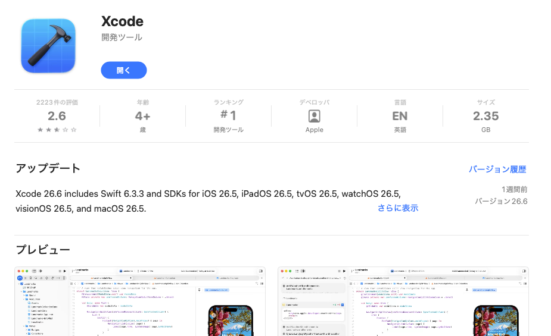
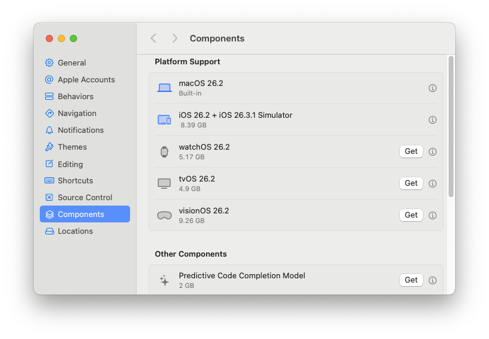
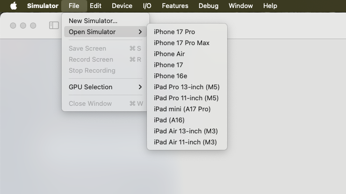
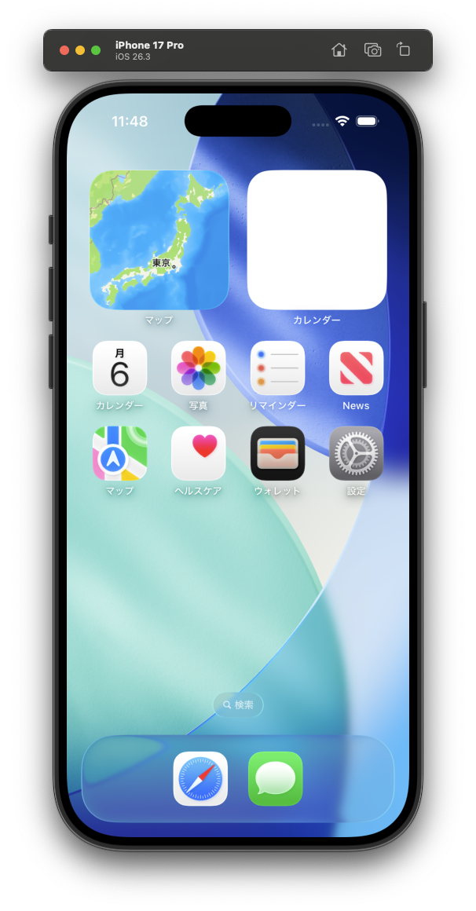

import Header from '../../../components/Header.astro'

<Header {...frontmatter} />

フロントエンド開発では、OSやブラウザの組み合わせによって挙動が異なることがあるため、できるだけ多くの環境を実機で確認することが望ましい。実機は用意できない場合でも、BrowserStackのようなサービスを使えばある程度は確認できる。しかし、利用料は決して安くはない。

この記事では、macOSのSimulatorアプリを使って、iOS環境でWebサイトを確認する方法を紹介する。


## 環境構築

Apple社が提供する開発ツール「Xcode」が必要なので[App Store](https://apps.apple.com/jp/app/xcode/id497799835)からインストールする。（ファイルサイズが大きいので、ダウンロードに時間がかかる場合がある）



インストールできたらXcodeを起動し、メニューから Xcode > Settings > Components > iOS を開いて、iOSのシミュレーター（Simulator）をインストールする。


デバイスのアイコンが青色になればインストール完了で、Simulatorアプリが使えるようになる。



## Simulatorを使った動作確認

Simulatorアプリを起動して、メニューから File > Open Simulator > iPhone 17 Pro のように確認したいデバイスを選択する。




すると、仮想デバイスのウィンドウが表示される。操作はiPhoneやiPadとほぼ同じように操作できる。



Simulator内のブラウザ（iOS版Safari）を起動して、確認したいURL（`https://localhost:3000` など）を入力することで、実機に近い環境で検証できる。


## Webページが文字化けするときに対処法

デバッグ対象のページを開くと、日本語が`[?]`のように表示されることがある。切り分けとして、Simulator内のアプリや設定などが文字化けする場合は、Simulator側の言語設定が原因である可能性が高い。

一方、特定のWebページだけ文字化けする場合は、`font-family`が指定されていない、もしくは不十分なことが原因で発生している可能性が高い。以下のように指定するだけでも文字化けを回避できる場合がある。

```css
:root {
  --font-faces-windows: "Meiryo";
  --font-faces-mac: "Hiragino Sans", "Hiragino Kaku Gothic Pro";
  --font-faces-fallback: "Arial", sans-serif;
}

html {
  font-family: var(--font-faces-windows), var(--font-faces-mac), var(--font-faces-fallback);
}
```

## 覚えておくと便利なショートカット

Simulatorでは画面端からのジェスチャーが再現できないため、ショートカットキーを使う。

- Command + Shift + H: ホーム画面にもどる
- Command + Shift + H を素早く2回: タスクウィンドウを表示する
